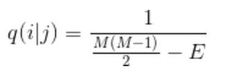

# mcmc-simulation [](https://travis-ci.org/oddguan/MCMC-Simulation)[](https://coveralls.io/github/oddguan/MCMC-Simulation?branch=master)
> Markov Chain Monte Carlo with Metropolis-Hastings Algorithm implemented in Node.js

## Introduction

This is a project that I did for applying the Metropolis-Hastings Algorithm onto a undirected weighted graph. The program starts by specifying the number of nodes on the graph, the coordinates of nodes, and the number of timesteps for the markov chain.
The relative probability of going from one state to another is calculated by the following equation: 


where:


The first term calculates the total weight of the edges in the graph, and the second term calculates the total weights of going from one source node s to every other node in the graph through shortest path.

The proposal distribution is defined as followed:




where qij defines the probability of going to the new state, and qji defines the probability of going back to the current state from new state. With all of these, we can finally calculates the final Metropolis-Hastings probability:


## Installation

```sh
$ git clone https://github.com/oddguan/MCMC-Simulation
$ cd MCMC-Simulation
$ npm install --save mcmc-simulation
```

## Usage

To run the program in the simplest form, simply use:
```sh
$ node lib/index.js
```

### Arguments:

* `-t/--Temperature`: The T variable specified in first equation above. Default: 300
* `-r`: The r variable specified in the first equation above. Default: 1
* `-i/--iteration`: The number of time steps that the markov chain goes through. Default: 1000
* `-n/--NumVertices`: The number of vertices that are going to be presented in the graph. Default: 5
* `-b/--burnin`: A flag to specify whether burn-in or not (still work-in-progess). Default: false
* `-c/--coordinates`: The coordinates of the nodes. Default: '[0,1,1,1,3,2,1,5,7,10]'

## Contributions

Contributions are welcome!!! Please feel free to submit a pull request, and I'll review it ASAP when I have time. If you are reading this, I really appreciate your time and I hope you'll enjoy using this simulator.


## TODO

* Burn-in functionality is currently not supported. Will be updated in the near future.

* Currently the project checks if two graphs are identical by counting the nodes, and doing a DFS starting at 0 on each of the graph to see if they produce the same result. This is obviously not good enough to compare two isomorphic graphs, but it should be good enough for my project. The API of jsnetworkx is just not friendly. Will update the project if the package improves its API.

* Few in-line comments are written because I kind of hate them. I think those console.log statements that I left in the script when I was debugging should explain most of the code about what I'm doing in a specific part of the script. There is a description for each function that I wrote.

## License

MIT © [Chenxiao Guan]()
